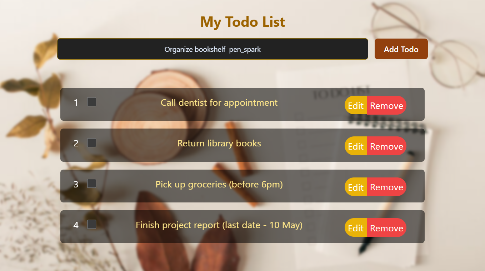

# Todo App

## Description

This is a modern and user-friendly todo list web application built using React, Redux Toolkit (or React Redux), react-router-dom, react-beautiful-dnd, and Tailwind CSS. It allows you to effectively manage your tasks by providing features such as:

- **Adding new tasks**: Effortlessly create new tasks with a clear input field.
- **Removing tasks**: Clear completed or unwanted tasks with a single click.
- **Editing tasks**: Modify existing tasks to ensure they accurately reflect your needs.
- **Reordering tasks**: Drag and drop tasks to prioritize them based on importance or urgency.
- **Completed checkbox**: Mark tasks as completed to keep track of your progress and maintain a clear list.

## Technologies Used

- **Frontend**: React, react-router-dom, React Toolkit (or React Redux)
- **Styling**: Tailwind CSS
- **Drag and Drop**: react-beautiful-dnd

## Installation

Clone the repository:

```bash
git clone https://github.com/Ashvary1996/todo_app
```

#### Install dependencies:

```bash
cd todo_app
npm install
```

#### Running the App:

Start the development server:

```bash
npm start
```

The app will typically be accessible at http://localhost:3000/ in your browser.

## Usage

- **Add new tasks**: Enter your task description in the input field and click "Add Task" or press Enter.
- **Remove tasks**: Click the checkbox next to a completed task or click the "Remove" button associated with the task.
- **Edit tasks**: Click the task description to enter edit mode. Update the description and press Enter to save changes.
- **Reorder tasks**: Drag and drop tasks to the desired position in the list.
- **Completed checkbox**: Check the checkbox next to a task to indicate its completion. Completed tasks are typically visually distinguished (e.g., strikethrough text, faded out).


## Landing Page 



 ## Live Link

Check out the live version of the app: [Todo App](https://mytodoapp-v2.netlify.app/)
